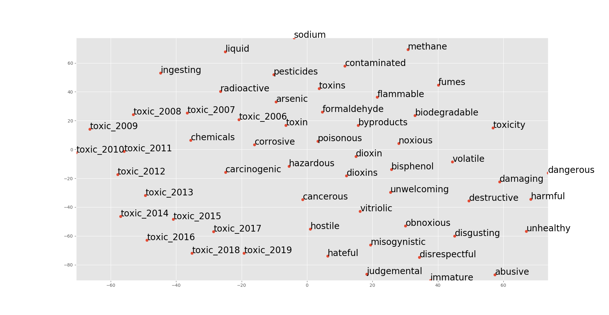

# Projects

Here is a collection of my most important projects.

## ["This is lit, fam": Diachronic word embeddings and classifying semantic change](https://teemursu.github.io/assets/documents/ba_thesis_teemu_poyhonen.pdf)

This is my project for my Bachelor's Thesis. The aim is to examine whether word embeddings can be used effectively to provide evidence for semantic shifts, and specifically, how we may operationalize traditional categories of semantic change in terms of word embeddings. The methodology for training diachronic word embeddings is borrowed from the [TWEC approach](https://ojs.aaai.org//index.php/AAAI/article/view/4594) by Di Carlo, V. et al. 

The data used consists of Reddit comments ranging from 2006 to 2019. First, we train an embedding for each of these years. Then, for a target word, such as "toxic," we take the ten most similar words for each year. With these neighboring words, we take their most recent (2019) position on the vector space, as well as the position of the word "toxic" for each year. Then, we transform these highly dimensional positions using principal component analysis (PCA),  constructing  a  two-dimensional  vector  space  representation  consisting  of  each  of  the neighboring  words  and  the  target  words for  each  of the  years.

{: .center}
{:width="130%"}

As can be seen from the two-dimensional projection, the word "toxic" changes from a more chemical associated context (poisonous) to a more social context (toxic masculinity.) In this sense, according to Bloomberg's semantic change categories, this change could be classified as a metaphorical change.

## [Multi-label text classification with RoBERTa](https://teemursu.github.io/assets/documents/idl_project_report.pdf)

This project was for the Introduction to Deep Learning course. The project report covers our experiments with DistilBERT, BERT base and RoBERTa. We used the AdamW optimizer with weight decay and epsilon. The data used for this project was from the Reuters corpus, with 126 different labels and almost 300,000 instances. The dataset was extremely imbalanced with some of the labels not even occurring in the training data. Because of this, we used the pos_weight parameter in the `BCEWithLogitsLoss` function.

The project was held in a form of Kaggle competition, where the access to a test set was given only at the end of the course. The following evaluation metrics are based on the development set. My group ranked the second out of nine total groups.

{: .center}
{:width="74%"}

With RoBERTa, we achieved a macro F1-score of 61%. The fact that micro-F1 score is significantly higher than the macro counterpart shows that the model performs poorly on the least frequent labels, and better on the most common ones.

{: .center}
{:width="70%"}

As can be seen, the model performs very well on the most common labels.

{: .center}
{:width="70%"}

Nevertheless, when looking at the least frequent labels, we can see that the model does not perform that well. The labels which did not contain an instance in the training data were omitted from the table. 

On the test set that was kept until the end of the course, we achieved an `F1-score 0.59` with precision 0.63 and recall 0.56. The first group did considerably better due to much higher recall, 0.64 (F1-score 0.62 and precision 0.61)

# Smaller projects during my Bachelor studies

These are some of my first projects when I was still studying Machine Learning and learning to code.
## [Proverb Search Engine (TFIDF)](https://github.com/aarniolaura/schwas/tree/master/Final_project)

This search engine uses TFIDF to search for proverbs. Data was first gathered using BeautifulSoup from various websites (mostly from phrases.org.uk). The search engine has stemming, and can also search by meaning of the phrase. This is done by searching the definitions of all proverbs.

I'm hoping to soon host this application on a site like Heroku, but I'm having some difficulties with it.

## [Word Sense Disambiguation](naive_bayes_wsd.html)

My first machine learning system built for "Machine Learning for Linguists" course. I used the naive Bayes classifier to disambiguate between words hard, interest, serve and line. As my data, I used the Senseval 2 corpus.

