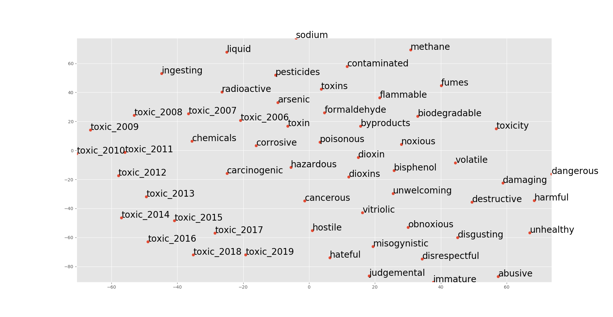

# Projects

Here is a collection of my most important projects.

## ["This is lit, fam": Diachronic word embeddings and classifying semantic change](https://www.dropbox.com/s/8bktqs8vs9sj3r6/P%C3%B6yh%C3%B6nen_Teemu_BA_Thesis.pdf?dl=0)

This is my project for my Bachelor's Thesis. The aim is to examine whether word embeddings can be used effectively to provide evidence for semantic shifts, and specifically, how we may operationalize traditional categories of semantic change in terms of word embeddings. The methodology for training diachronic word embeddings is borrowed from the [TWEC approach](https://ojs.aaai.org//index.php/AAAI/article/view/4594) by Di Carlo, V. et al. 

The data used consists of Reddit comments ranging from 2006 to 2019. First, we train an embedding for each of these years. Then, for a target word, such as "toxic," we take the ten most similar words for each year. With these neighboring words, we take their most recent (2019) position on the vector space, as well as the position of the word "toxic" for each year. Then, we transform these highly dimensional positions using principal component analysis (PCA),  constructing  a  two-dimensional  vector  space  representation  consisting  of  each  of  the neighboring  words  and  the  target  words for  each  of the  years.

As can be seen from the two-dimensional projection, the word "toxic" changes from a more chemical associated context (poisonous) to a more social context (toxic masculinity.) In this sense, according to Bloomberg's semantic change categories, this change could be classified as a metaphorical change.

## [Word Sense Disambiguation](https://github.com/Teemursu/teemursu.github.io/blob/master/dd%20(6)%20(10)%20(2).ipynb)

My first machine learning system built for "Machine Learning for Linguists" course. I used the naive Bayes classifier to disambiguate between words hard, interest, serve and line. As my data, I used the Senseval 2 corpus.

## [Proverb Search Engine (TFIDF)](https://github.com/aarniolaura/schwas/tree/master/Final_project)

This search engine uses TFIDF to search for proverbs. Data was first gathered using BeautifulSoup from various websites (mostly from phrases.org.uk). The search engine has stemming, and can also search by meaning of the phrase. This is done by searching the definitions of all proverbs.

I'm hoping to soon host this application on a site like Heroku, but I'm having some difficulties with it.

